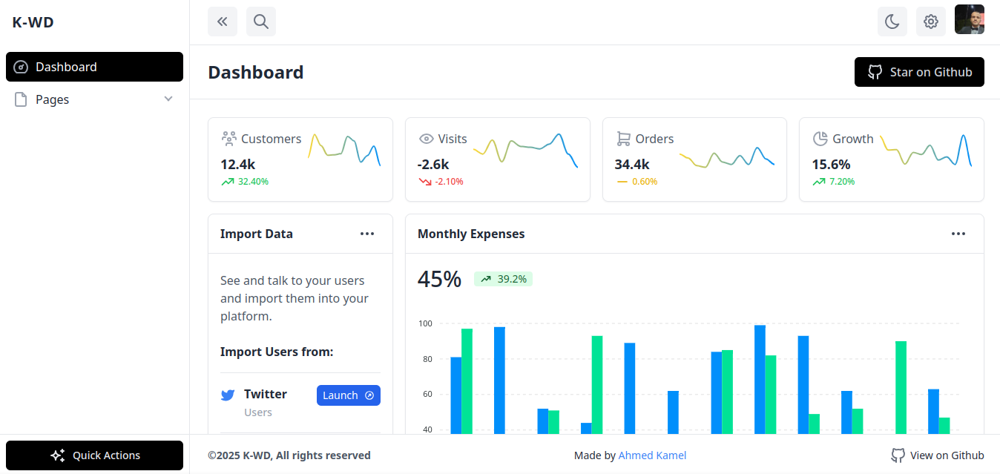
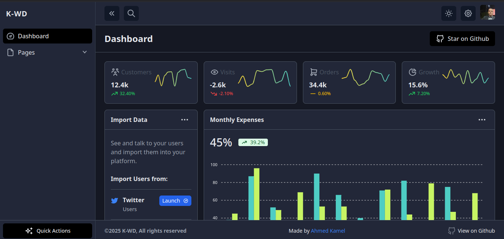

# Starter Dashboard Layout

Starter responsive dashboard layout built with tailwindcss and alpinejs

[](https://github.com/Kamona-WD/starter-dashboard-layout/blob/main/License.md)
[](https://github.com/Kamona-WD/starter-dashboard-layout/stargazers)

#### Screens

|                                      |                                    |
| ------------------------------------ | ---------------------------------- |
|  |  |

### [See live](https://kamona-wd.github.io/starter-dashboard-layout/)

### Vue version
#### [Live](https://kamona-wd.github.io/starter-dashboard-layout-vue/)
#### [Github repo](https://github.com/Kamona-WD/starter-dashboard-layout-vue/)

### Another project

#### K-WD Dashboard
#### [Live](https://kamona-wd.github.io/kwd-dashboard/)
#### [Github repo](https://github.com/Kamona-WD/kwd-dashboard/)

---

To get started:

1. Clone the repository:

```bash
git clone https://github.com/Kamona-WD/starter-dashboard-layout.git

cd starter-dashboard-layout
```

2. Install the dependencies:

```bash
yarn

# Using npm
npm install
```

3. Start the development server:

```bash
yarn dev

# Using npm
npm run dev
```

## Building for production

To build an optimized version of your CSS & html, simply run:

```bash
yarn build

# Using Yarn
npm run build
```

---

## Support

[](https://www.paypal.me/Akamel721/)
